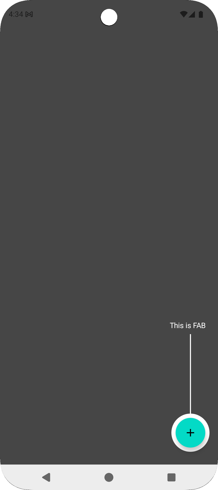
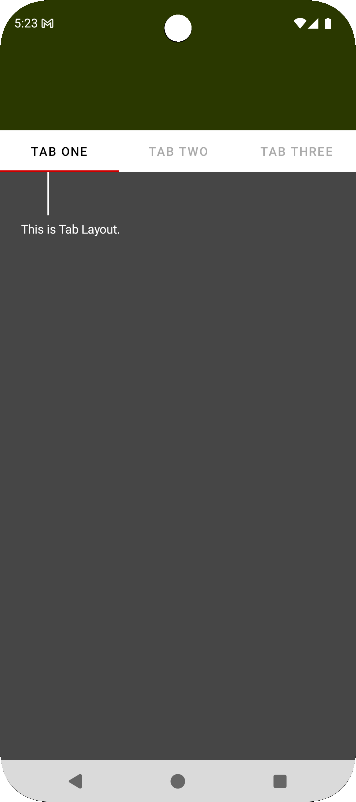
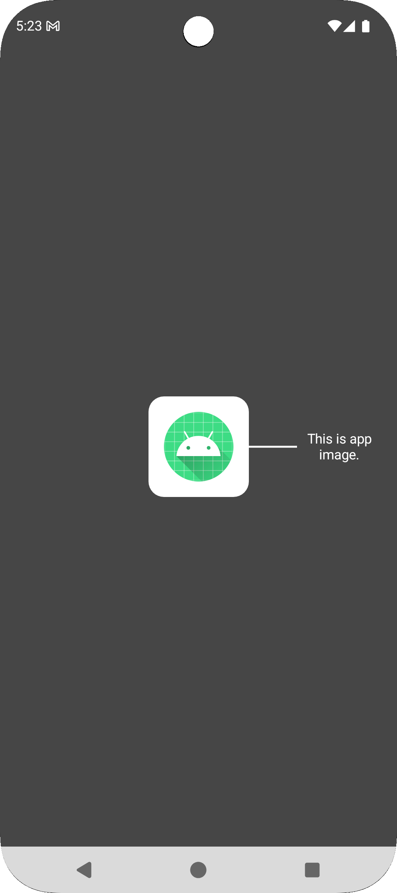
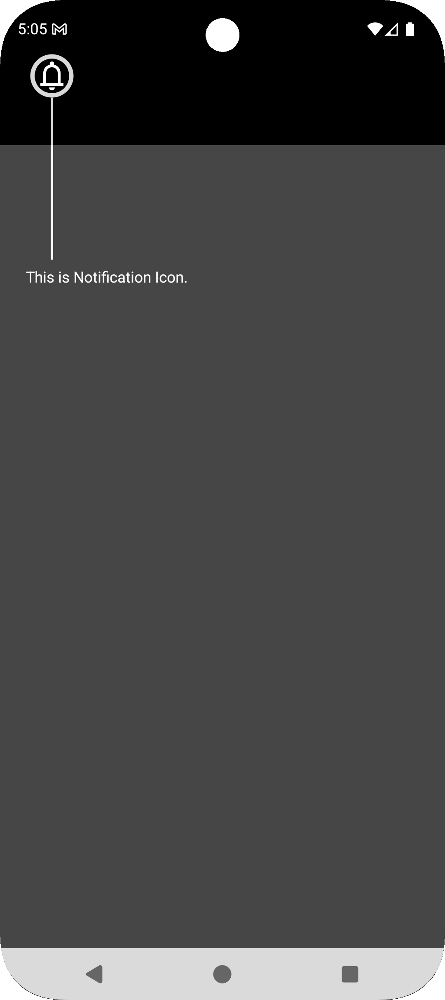
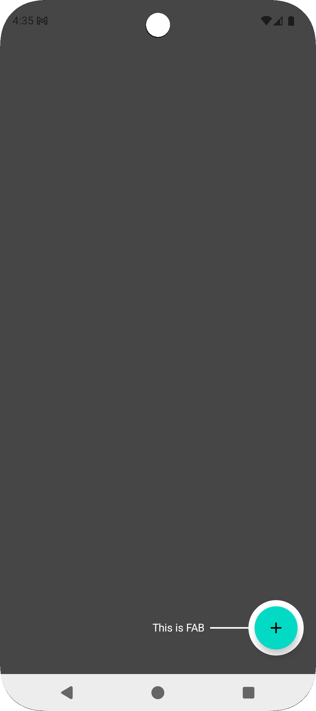
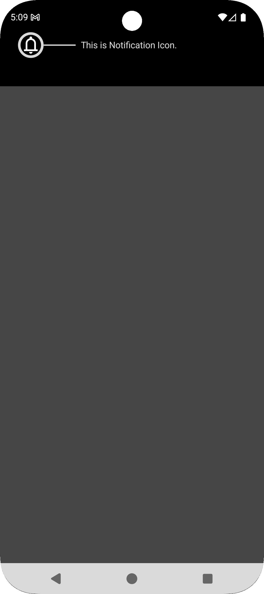

# IlluminaOverlayView

A customizable Android overlay library for highlighting UI elements with tooltips.  
Supports both circle and rounded rectangle highlights, with a connecting line to descriptive text.

---

## ✨ Features

- Highlight any target **View** with a transparent cutout.
- Supports **Circle** or **Rounded Rectangle** shapes.
- Adds an informative **tooltip text** connected via a line.
- Automatically adjusts to keep text **on-screen**.
- Fully customizable:
    - Colors (background, highlight, line, text)
    - Line width and length
    - Text size
    - Highlight radius
    - Margins from line
- Supports multiple highlights in a single overlay.

---

## 📦 Installation

**Step 1:** Add JitPack to your root `build.gradle`:

```gradle
allprojects {
    repositories {
        google()
        mavenCentral()
        maven { url 'https://jitpack.io' }
    }
}
```

**Step 2:** Add the dependency in your module `build.gradle`:

```gradle
dependencies {
    implementation 'com.github.Syetchau:IlluminaOverlayView:1.0.0'
}
```

Or via Version Catalog `libs.versions.toml`:

```libs.versions.toml
[libraries]
illumina-overlay = { group = "com.github.Syetchau", name = "IlluminaOverlayView", version = "1.0.0" }
```

```gradle
dependencies {
    implementation(libs.illumina.overlay)
}
```

## 🛠 Usage
**Step 1:** Add the OverlayView in your layout:

```xml
<io.illumina.overlay.OverlayView
    android:id="@+id/overlayView"
    android:layout_width="match_parent"
    android:layout_height="match_parent"/>
```

**Step 2:** Configure overlays in code:

```kotlin
val configs = listOf(
    OverlayConfig(
        view = binding.buttonNext,
        text = "This is the next button",
        overlayAnchorPosition = Position.Top
    ),
    OverlayConfig(
        view = binding.textViewInfo,
        text = "This shows info",
        overlayAnchorPosition = Position.End
    )
)
overlayView.configs = configs.toTypedArray()
```
**Step 3:** Customize colors, radius, and spacing programmatically:

```kotlin
overlayView.apply {
    overlayBackgroundColor = Color.parseColor("#80000000")
    highlightColor = Color.YELLOW
    overlayLineColor = Color.WHITE
    overlayTextColor = Color.WHITE
    highlightRadius = 16f
}
```

## 🔧 Attributes (XML)

| Attribute                    | Description                           | Default                |
|------------------------------|---------------------------------------|------------------------|
| `overlayBackgroundColor`     | Background dim color                  | Black with 80% opacity |
| `overlayLineColor`           | Color of line connecting text         | White                  |
| `overlayTextColor`           | Tooltip text color                    | White                  |
| `overlayTextSize`            | Tooltip text size                     | 14sp                   |
| `overlayCornerRadius`        | Rounded rect corner radius            | 0dp                    |
| `overlayLineWidth`           | Width of connector line               | 2dp                    |
| `overlayLineLength`          | Length of connector line              | 40dp                   |
| `overlayLineSpacingWithText` | Spacing between line and text         | 8dp                    |
| `highlightRadius`            | Extra padding around highlighted view | 12dp                   |
| `marginStartFromOverlayLine` | Line start margin                     | 0dp                    |
| `marginEndFromOverlayLine`   | Line end margin                       | 0dp                    |

## 📸 Screenshots
### 🔹 Shape Types

<table>
<tr>
<td align="center">
  <br><br>
  <b>Circle</b>
</td>
<td align="center">
  <br><br>
  <b>Rectangle</b>
</td>
<td align="center">
  <br><br>
  <b>Rounded Rectangle</b>
</td>
</tr>
</table>

### 🔹 Anchor Positions
<table>
<tr>
<td align="center">
  <br><br>
  <b>Top</b>
</td>
<td align="center">
  <br><br>
  <b>Bottom</b>
</td>
<td align="center">
  <br><br>
  <b>Start</b>
</td>
<td align="center">
  <br><br>
  <b>End</b>
</td>
</tr>
</table>

## 🤝 Contributing

Contributions are always welcome!
Please open issues or pull requests for improvements and bug fixes.

---

## 📝 License

MIT License © 2025 Syet Chau

